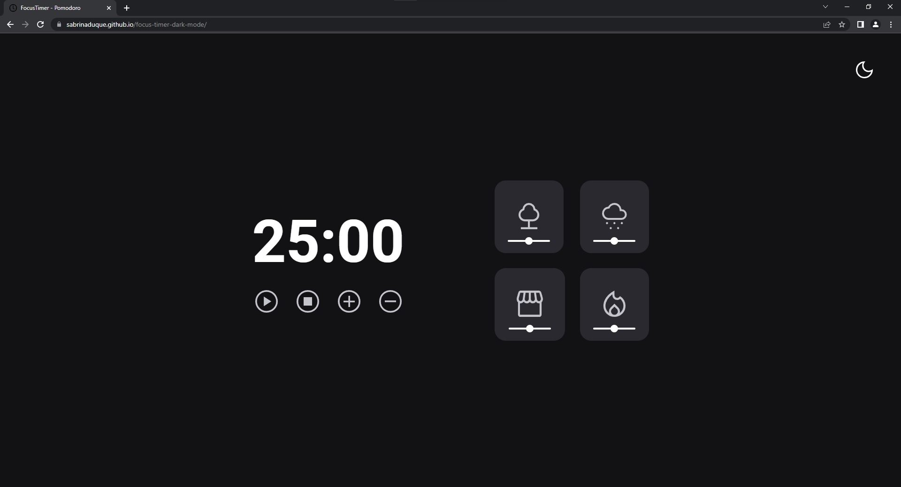

<h1 align="center"> Focus Timer </h1>

Projeto tem como objetivo masterizar/demonstrar qualidades técnicas no front-end.  

  <a href="#-tecnologias">Tecnologias</a>&nbsp;&nbsp;&nbsp;|&nbsp;&nbsp;&nbsp;
  <a href="#-projeto">Projeto</a>

  

 

## 🚀 Tecnologias

Esse projeto foi desenvolvido com as seguintes tecnologias:

- HTML e CSS
- JavaScript
- Git e Github

## 💻 Projeto

Este projeto Focus Timer foi criado com a intenção de simplificar sua rotina de trabalho e incentivá-lo a alcançar um equilíbrio saudável entre produtividade e descanso. Aproveite ao máximo suas sessões de trabalho, minimize distrações e desfrute de intervalos regulares para recarregar sua mente.

 <h3 align="start"> ⚙️ Funcionalidades</h3>
 
 Alternar o tema da aplicação: Botão superior direito

Botões localizados abaixo do timer, no canto inferior esquerdo:

- Play: Dispara
- Pause: Pausa timer

- Stop: Para o timer
- Alterar tempo: Possibilita inserir um tempo para o timer (em minutos)

- (ícone + ): Aumenta em 5 minutos o tempo do timer
- (ícone - ): Diminui em 5 minutos o tempo do timer

- Cards (lado direito): Disponibiliza quatro sons ao usuário (floresta, chuva, cafeteria ou lareira). Cada um acompanha um slider, onde é possível controlar o volume dos sons individualmente.
- [Visite o projeto online](https://sabrinaduque.github.io/focus-timer-dark-mode/)
